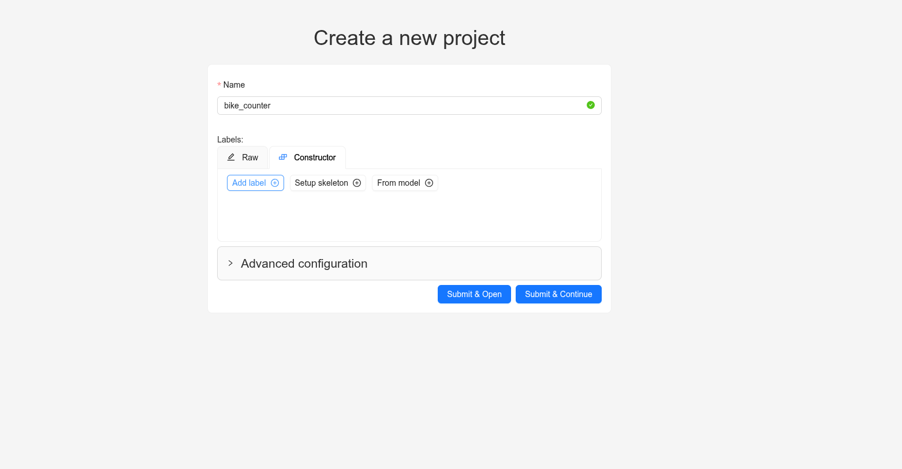
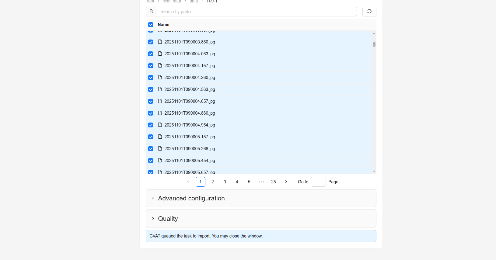
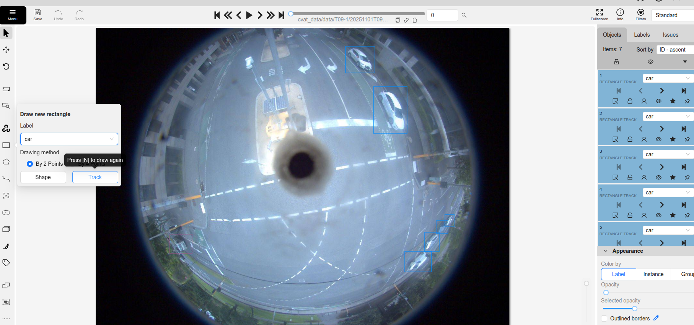
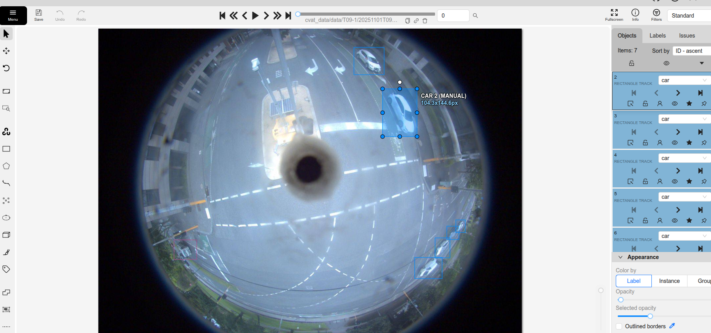
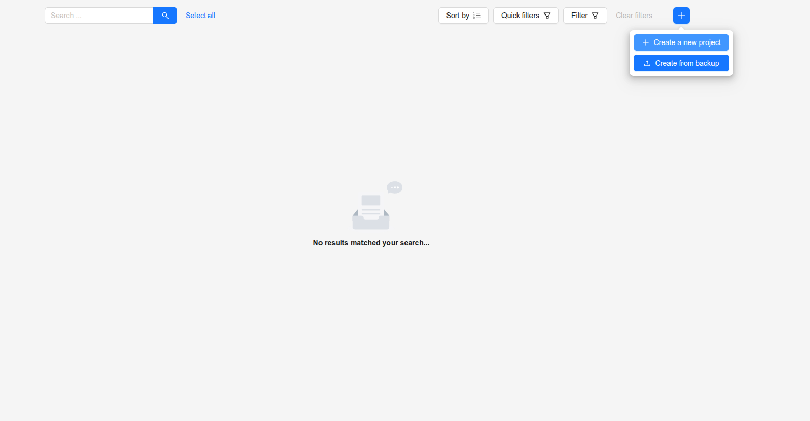
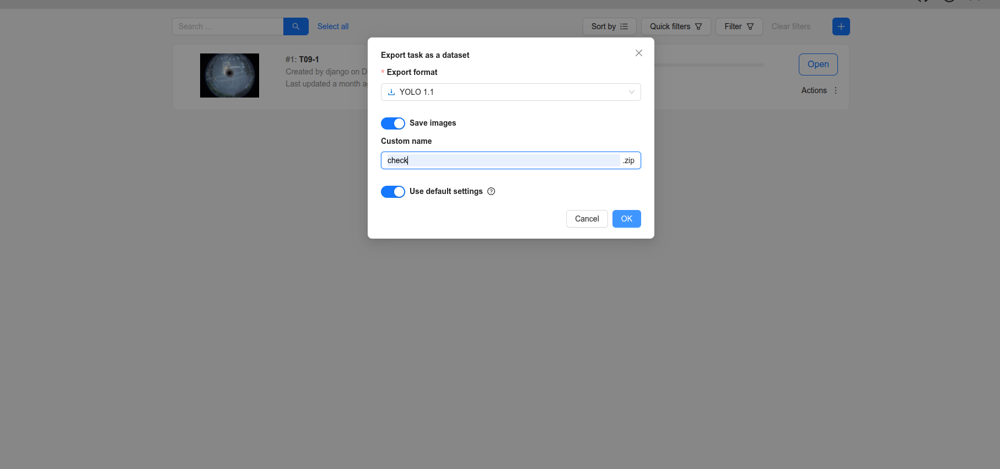

# CVAT Annotation & YOLO Training Guide

This document explains the **full end-to-end workflow** for:
- Annotating data using **CVAT**
- Exporting annotations in **YOLO 1.1** format
- Training an object detection model using **YOLO**

---

## 1. Open CVAT
- Open the CVAT web interface in your browser.
- Log in with your account.

---

## 2. Create a Project
1. Go to **Projects**.
2. Click **Create Project**.
3. Fill in:
   - **Project Name**
   - **Add Labels** (e.g., Add labels: `bus`, `car`, `truck`,  `bike`,    `pedestrian`)
4. Click **Submit & Continue**.
5. Upload or link your dataset if required.
6. Click **Submit & Continue** again.

✅ Project is now created.


---

## 3. Create a Task
1. Open the **already created project**.
2. Click **Create Task**.
3. Fill in the task details:
   - Task name
   - Select the project
   - Upload images or video
4. Click **Submit**.


---

## 4. Open Task & Start Annotation
1. Open the task.
2. You will see **Job #1**.
3. Click **Job #1** to start annotation.

---

## 5. Annotation Steps

### 5.1 Draw Bounding Boxes
1. In the annotation panel:
   - Click **Draw Rectangle**
   - Choose the correct **Label** (car, truck, etc.)

2. Set the drawing method to **By 2 Points**.
3. Click **Track**.

5. Draw a rectangle around the object.

---

### 5.2 Using Track Efficiently
- The **Track** function automatically propagates the bounding box to future frames.
- You can:
  - Skip **4–5 frames** using the **arrow keys**
  - Adjust the bounding box on those frames if needed

---

### 5.3 Adjusting Annotations
- After annotating one frame:
  - Move forward **4–5 frames** and adjust the bounding box
  - Go back to previous skipped frames
  - Fix only **missing or incorrect annotations**
- ❗ No need to re-adjust all labels
- CVAT automatically interpolates bounding boxes
- If a bounding box is very inaccurate, manually re-adjust it

---

## 6. Frame Navigation
- Use **arrow keys** to move between frames
- Continue until **all images or frames are annotated**

---

## 7. Export Annotations
1. Go to **Tasks**
2. Click **Export Annotation**

4. Select export format:
   - `YOLO 1.1`
5. Enter the **Export Name**
6. Click **Export**


🎉 Your dataset is now fully annotated and exported in **YOLO 1.1** format, ready for model training.

---

## 8. Annotator Tips for Speed & Accuracy

### 8.1 Use Track Aggressively
- Annotate one clean frame
- Skip multiple frames
- Adjust instead of redraw

---

### 8.2 Adjust, Don’t Redraw
- Resize or move boxes when possible
- Redraw only when boxes drift too far

---

### 8.3 Skip Frames Smartly
- Skip smooth motion
- Focus on turns, occlusions, sudden motion

---

### 8.4 Keep Boxes Tight
- Cover the object fully
- Avoid extra background

---

### 8.5 Label Consistency
- Same object = same label across frames
- Never switch class types

---

### 8.6 Occlusion Handling
- Partially visible → annotate visible part
- Fully disappeared → stop tracking
- Resume when object reappears

---

### 8.7 Zoom for Precision
- Zoom in for small objects
- Avoid large inaccurate boxes

---

### 8.8 Review Before Export
Check for:
- Missing labels
- Wrong classes
- Box drifting

---

### 8.9 Speed vs Quality Rule
- Fast + consistent > slow + perfect
- Missing labels are worse than small box errors

---

## 9. Training the Model (YOLO)

This section explains how to train an object detection model using exported CVAT annotations.

---

## 9.1 Exported Dataset Structure
After exporting from CVAT (YOLO 1.1):
```
dataset/
├── images/
│ ├── img_001.jpg
│ ├── img_002.jpg
│ └── ...
├── labels/
│ ├── img_001.txt
│ ├── img_002.txt
│ └── ...
└── classes.txt
```

## 9.2 YOLO Label Format
Each `.txt` file contains:
<class_id> <x_center> <y_center> <width> <height>


- Values are normalized (0–1)
- One line per object
- `class_id` must match `classes.txt`

---

## 9.3 Split Dataset
Recommended split:
- 80% training
- 20% validation

Example structure:
```
dataset/
├── train/
│ ├── images/
│ └── labels/
├── val/
│ ├── images/
│ └── labels/
└── classes.txt
```
---

## 9.4 Create `data.yaml`
Example:

```
path: dataset
train: train/images
val: val/images

names:
  0: bus
  1: car
  2: truck
  3: bike
  4: pedestrian
```

## 9.5 Train YOLO Model
```
yolo task=detect mode=train model=yolov9e.pt data=data.yaml epochs=40 imgsz=640 batch=5
```
